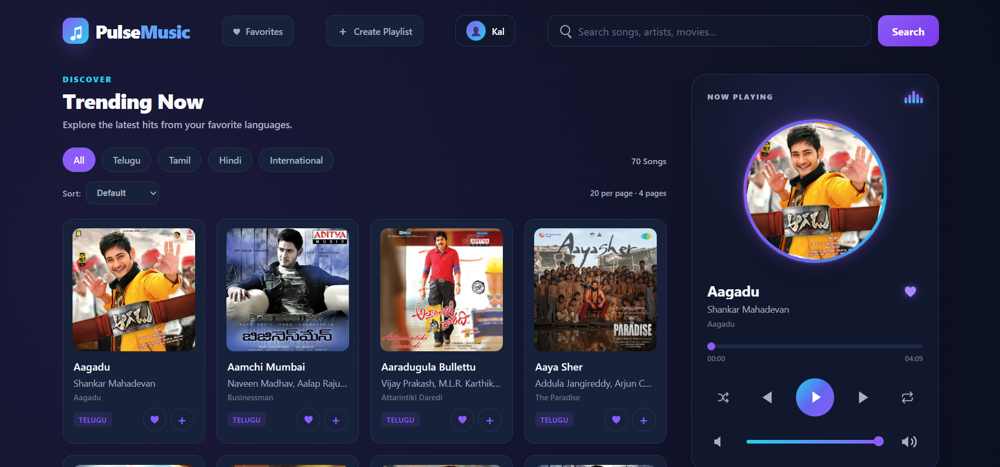
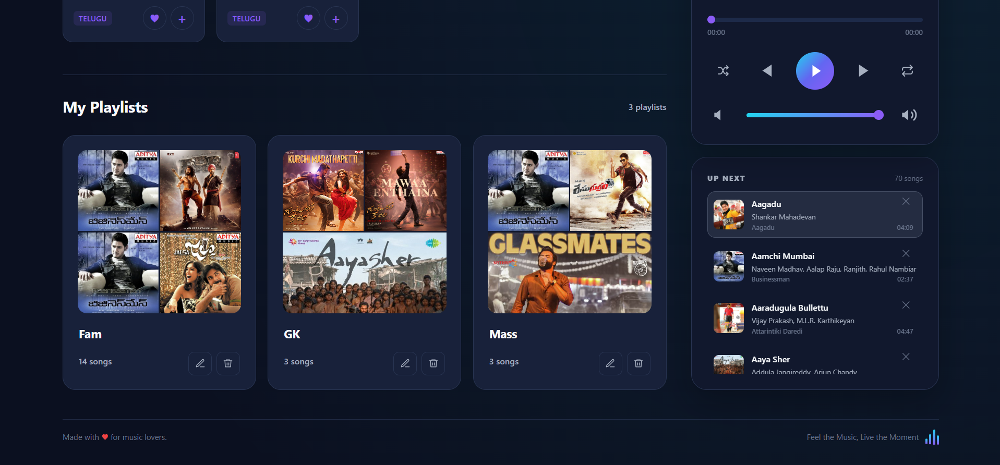
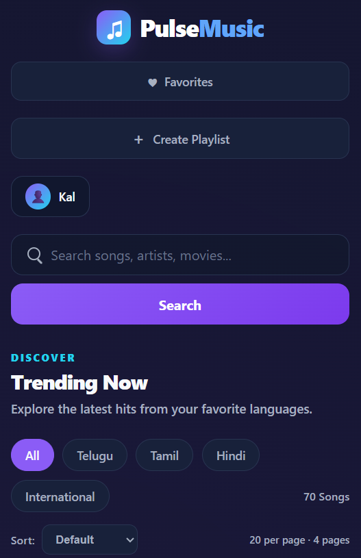

# 🎵 PulseMusic

A modern and responsive music streaming web application that helps users discover, explore, and organize their favorite songs and playlists.

## 🌐 Live Demo

[PulseMusic](https://pulsemusic-player.vercel.app/)

## 📌 About the Project

PulseMusic is a full-featured music streaming web application built with HTML, CSS, and JavaScript.

The application uses Supabase for user authentication and persistent playlist and favorite song management.

The project was designed with a focus on a clean user interface, responsive design, smooth music playback, and an engaging user experience.

## ✨ Features

### 🎧 Music Player
- Play and pause songs
- Previous and next track controls
- Seek through songs
- Volume control
- Mute / unmute
- Shuffle mode
- Repeat mode
- Current time and duration
- Animated rotating album disk
- Queue management
- Active queue highlighting
- Remove songs from queue

### 🔎 Song Discovery
- Browse songs
- Search songs by title
- Filter songs by language
- Sort songs
- Pagination
- Song cards with cover artwork and details

### ❤️ Favorites
- Add songs to favorites
- Remove songs from favorites
- Dedicated favorites section

### 📂 Playlists
- Create playlists
- Rename playlists
- Delete playlists
- Add songs to playlists
- Remove songs from playlists
- Prevent duplicate songs in playlists
- Playlist covers based on songs
- Playlist data persists using Supabase

### 🕘 Recently Played
- Track recently played songs
- Display recently played songs
- Remove songs from recently played

### 🔐 Authentication
Powered by Supabase Authentication.

- User registration
- Login
- Logout
- Email confirmation
- Forgot password
- User profile/account menu
- Display authenticated user's name
- Session-based authentication

### 📱 Responsive Design
- Desktop layout
- Tablet layout
- Mobile layout
- Responsive song cards
- Responsive music player
- Mobile-friendly navigation and controls

## 📸 Screenshots

### Home Page



### Song Details



### Mobile View



## 🛠️ Technologies Used

- HTML5
- CSS3
- JavaScript
- Supabase
- Supabase Authentication
- Supabase Database
- Git
- GitHub
- Vercel

## 📁 Project Structure

```text
PulseMusic/
│
├── index.html
├── style.css
├── script.js
├── data.js
├── metadata.js
├── supabase.js
├── generate-data.js
├── .gitignore
├── README.md
│
├── assets/
│   └── screenshots/
│       ├── home.png
│       ├── song-details.png
│       └── mobile.png
│
├── images/
│   ├── hindi/
│   ├── international/
│   ├── tamil/
│   └── telugu/
│
└── musics/
    ├── hindi/
    ├── international/
    ├── tamil/
    └── telugu/